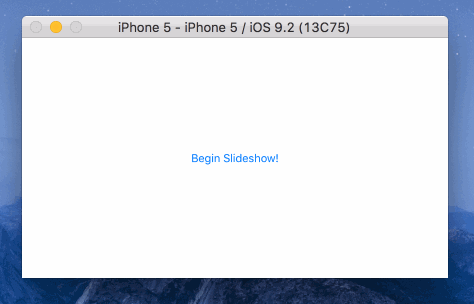

# OriginateSlideshow

> A customizable slideshow view controller.





## Installation with CocoaPods

Add the following lines to your Podfile and then run `pod install`.

```ruby
source 'https://github.com/Originate/CocoaPods.git'
pod 'OriginateSlideshow'
```


## Usage

Instantiate an `OriginateSlideshowViewController` and assign its `.dataSource` and `.delegate` properties for configuration. This should feel familiar to using a `UITableView`.

To being playing the slideshow, simply call `-resume` on the view controller.

### DataSource

```objc
@protocol OriginateSlideshowDataSource <NSObject>

- (NSUInteger)numberOfSlidesInSlideshow:(OriginateSlideshowViewController *)slideshow;
- (NSTimeInterval)slideshow:(OriginateSlideshowViewController *)slideshow durationForSlideAtIndex:(NSUInteger)index;
- (NSTimeInterval)bufferDurationAmountForSlideshow:(OriginateSlideshowViewController *)slideshow;
- (id<OriginateSlide>)slideshow:(OriginateSlideshowViewController *)slideshow slideAtIndex:(NSUInteger)index;
- (BOOL)slideshowShouldAutomaticallyDismissWhenFinished:(OriginateSlideshowViewController *)slideshow;

@end
```

### Delegate

```objc
@protocol OriginateSlideshowDelegate <NSObject>

- (void)slideshowIsReady:(OriginateSlideshowViewController *)slideshow;
- (void)slideshowIsFinished:(OriginateSlideshowViewController *)slideshow;
- (void)slideshowIsDismissed:(OriginateSlideshowViewController *)slideshow;

@end
```

### Slides

Each slide is an object that conforms to the `OriginateSlide` protocol. This flexible interface allows you to define custom slide types. The example project demonstrates how to create simple "photo slides".

#### Slide

Your slide object must conform to `<OriginateSlide>`.

```objc
@protocol OriginateSlide <NSObject>

@property (nonatomic, strong, readonly) NSURL* URL;
@property (nonatomic, weak, nullable) id<OriginateSlideDelegate> delegate;

- (instancetype)initWithURL:(NSURL *)URL;
- (void)loadIntoView:(nullable UIView *)view;
- (void)prepareForDismissal;
- (BOOL)canPreload;
- (Class)requiredContainerViewClass;

@end
```

#### Playback

If your slides have an intrinsic playback nature to them (videos for example), they should conform to `<OriginateSlideIntrinsicPlayback>`.

```objc
@protocol OriginateSlideIntrinsicPlayback <OriginateSlide>

- (NSTimeInterval)duration;
- (void)play;
- (void)pause;
- (void)stop;

@end
```

#### Delegate

Each slide has a `.delegate` property that allows it to provide the slideshow with additional information for a richer experience.

```objc
@protocol OriginateSlideDelegate <NSObject>

@optional

/// Tells delegate that the slide content has begun downloading
- (void)slideDidBeginLoading:(id<OriginateSlide>)slide;

/// Tells delegate that the slide content is visible
- (void)slideDidBeginPresenting:(id<OriginateSlide>)slide;

/// Tells delegate that the slide content is fully downloaded
- (void)slideDidFinishLoading:(id<OriginateSlide>)slide;

/// Tells delegate that it has completed presenting and is ready to be replaced
- (void)slideDidFinishPresenting:(id<OriginateSlide>)slide;

/// Tells delegate the current download progress of the slide content
- (void)slideLoadingProgress:(CGFloat)percentage;

@end
```

## License

OriginateSlideshow is available under the MIT license. See the [LICENSE](/LICENSE) file for more info.
